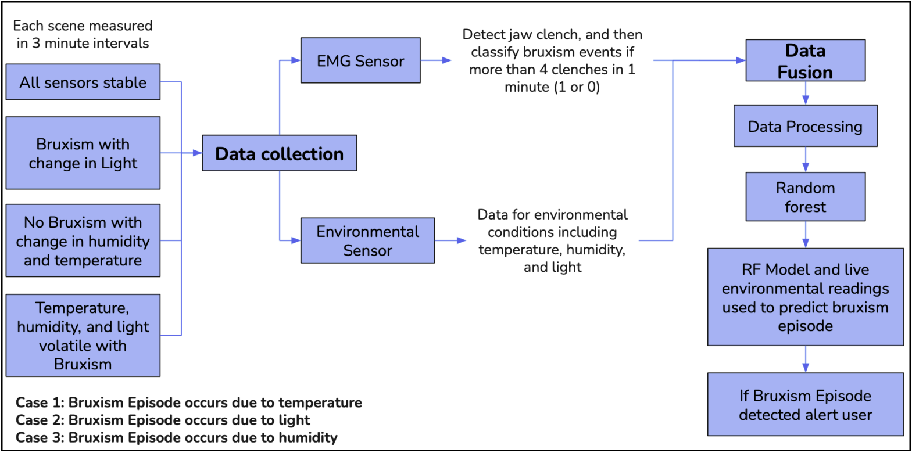
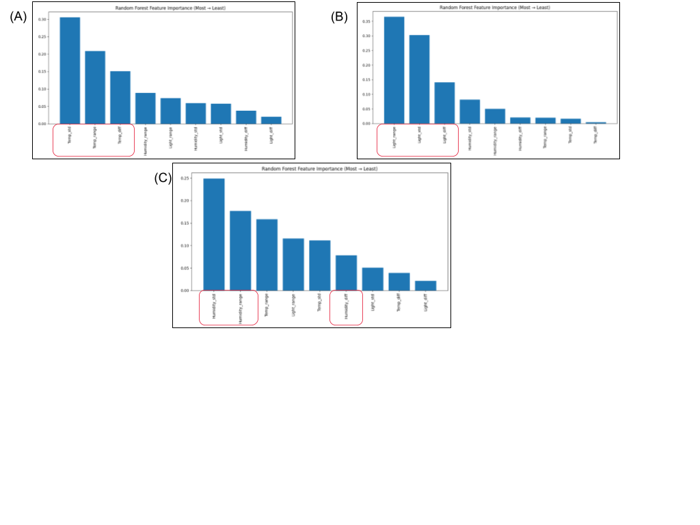

**Problem:** Sleep bruxism (teeth grinding) affects up to 10% of adults but most people 
don't know when or why it happens. Existing clinical tools require overnight lab stays. 
Environmental micro-arousal triggers — light, temperature, humidity — are poorly 
characterized in home settings.

**My contribution:** This was a graduate course project (MIE1050) built with two teammates. 
I contributions include the ML pipeline and data engineering, including:

- **Sensor fusion and data alignment** — upsampled low-frequency environmental sensor data 
to align with the high-frequency EMG timeline; extracted dynamic features per sensor 
(instantaneous change, rolling variance, rolling range) over 5000ms windows
- **ML pipeline** — trained a Random Forest classifier for three separate environmental 
trigger cases (temperature, light, humidity dominant); achieved ~100% validation accuracy 
across ~70,000 data points per case
- **Feature importance analysis** — confirmed that the principal environmental trigger for 
each case ranked highest in learned feature importance, validating that the model responds 
to real environmental patterns rather than noise
- **Risk analysis** — performed feature-wise sensitivity analysis showing how predicted 
bruxism probability changes with controlled variation in dominant features, producing 
actionable thresholds for users

**Result:** System correctly identifies both bruxism episodes and the dominant environmental 
trigger in real-time, displaying alerts on an LCD and providing post-session trigger 
analysis. The model successfully disentangles correlated variables — temperature and 
humidity are inversely coupled in practice, yet the model correctly attributes causality 
to the principal trigger in each case.

**Tools:** Python (PySerial, scikit-learn, pandas), Arduino, EMG sensing, 
Adafruit BME680, photoresistor, Random Forest, joblib
